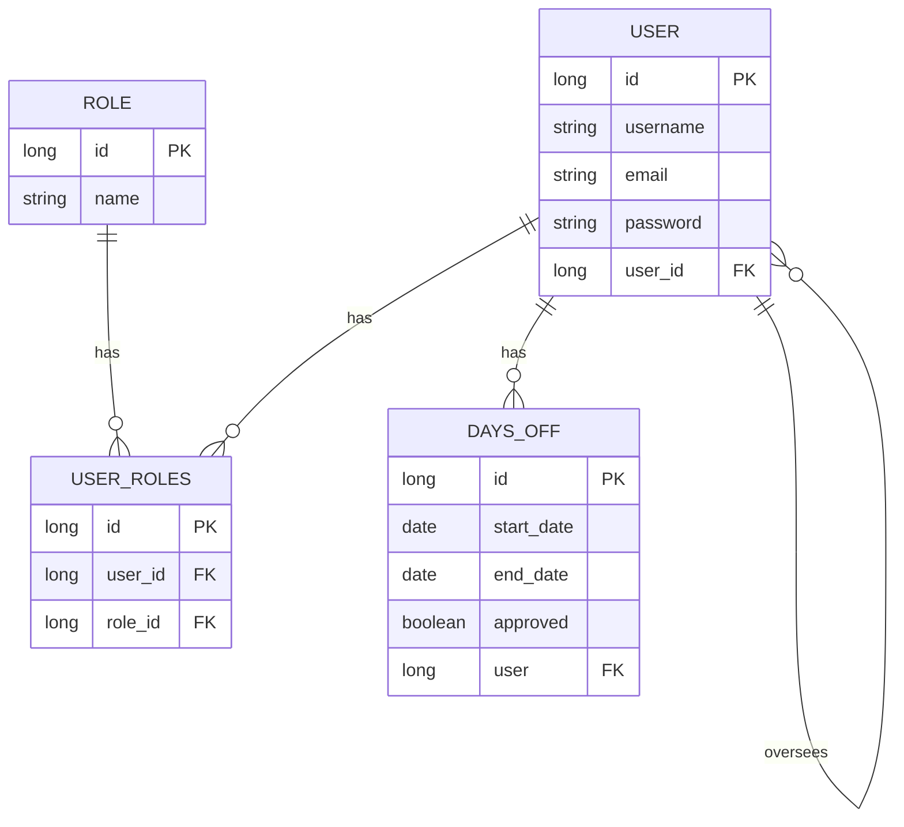

# Rezumat
- La secțiunea Notițe Curs găsiți ce s-a cerut la curs pentru acest proiect;
- La secțiunea Observații se află niște notițe personale;
- La secțiunea Funcționalități aveți funcționalitățile proiectului model;
- Am încărcat inclusiv fișerele autogenerate pentru a vedea mai clar cum ar trebui să arate tot, dacă întâmpinați probleme ștergeți package-lock.json, .idea etc. 
## Funcționalități:
- 

## Notițe Curs (Dragoș):

Expunem un API din backend pe care sa il consume frontend-ul.

Definition of done!!! - setarea unui goal general

Testare - 200 de users, 200000 de users
- ce se intampla la erori (fisiere de log)
- testarea unitara
- lucru pe task-uri mici, testate imediat dupa implementare
- lucru pe snapshots pentru a putea reveni rapid la o versiune stabila

Environment setup, skeleton, baza de date, operatii CRUD
Gasirea celor mai importante task-uri
backend mai intai, pentru ca pot fi testate separat
frontend ulterior: design (+ navigare intre pagini)
legatura frontend-backend
se poate lucra pe mock-uri pe frontend
unit teste pe backend (CI)
fisiere de log pe care sa le pastram
documentatie (cu definition of done)

Utilizatorii:
se autentifica - stiu cine este
se autorizeaza - stiu ce drepturi are

Cerinte functionale:
1. Gestiunea autentificarii + autentificarii
Sign In/Sign up, logare prin cod de autentificare, logare prin card etc.
2. Solicitarea de concediu + View asupra zilelor de concediu
3. Aprobarea/Respingerea concediului + Definirea si modificarea numarului zilelor de concediu/angajat
4. Stabilirea numarului de zile de concediu
5. Stabilirea sefilor

Cereri nonfunctionale:
Sarbatorile legale pot fi hard-codate

Identificarea actorilor + actiunilor lor:
Administrator (practic, face toate actiunile, are toate drepturile: 1, 2, 3, 4, 5)
Autentificare + Autorizare
Cere concediu
Stabileste sefii ierarhici
Stabileste numarul de zile de concediu
Isi aproba singur concediul
Ar putea lasa delegati pentru aprobarea de concedii atunci cand un sef este in concediu
Seful ierarhic (1, 2, 3, 4)
Autentificare + Autorizare
Cere concediu
Stabileste cate zile de concediu are un angajat
Aproba si respinge concedii
Defineste si modifica numarul de zile de concediu/an/angajat
Angajatul (1, 2)
Autentificare + Autorizare
Cere concediu
Vede un raport al zilelor de concediu (probabil tabelar)

Baza de date:


-------------------------------------------------------------------------------------------------------------------------------------------
Obs.:
1. Adminul poate avea sef si poate fi la randul sau sef. Important este sa aiba token-ul de admin pentru a putea realiza toate actiunile.
2. Pe Frontend, sa existe consistenta a layout-ului, sa se tina cont de UX (Partea de UI, mai putin importanta: responsive, estetica etc.)

-------------------------------------------------------------------------------------------------------------------------------------------

# Observații:
## Capacitate utilizatori
Testarea comportamentului aplicației în funcție de numărul de utilizatori intră mai mult în teritoriul Testării Automate sau de Performanță, iar din păcte acest tip de teste nu se pot face direct din Spring.

O să folosim ***JMetter*** pentru a face aceste teste.
## Sistemul de Log
https://www.baeldung.com/spring-boot-logging

Avem mai multe optiuni:
- Sistemul builtin
- Lombok
- Log4j2


Salvarea in fișiere. Implicit sistemul afișează doar în consolă, dacă dorim să salvăm în fișier vom modifica ***application.properties*** cu următoarele configurări.
```properties
logging.file.name=log.text
#Print the rest of the logging, besides INFO type
logging.level.root=warn
logging.level.org.springframework.web=debug
logging.level.org.hibernate=error
```

https://docs.spring.io/spring-boot/docs/2.1.18.RELEASE/reference/html/boot-features-logging.html

Exemplu utilizare Logging (builtin) într-un CustomAuthenticationSuccessHandler.java (pentru autentificare):
```java
@Component
public class CustomAuthenticationSuccessHandler implements AuthenticationSuccessHandler {
    Logger logger = LoggerFactory.getLogger(CustomAuthenticationSuccessHandler.class);

    @Override
    public void onAuthenticationSuccess(HttpServletRequest request, HttpServletResponse response, Authentication authentication) throws IOException, ServletException {
        Collection<? extends GrantedAuthority> authorities = authentication.getAuthorities();
        if (authorities.contains(new SimpleGrantedAuthority(Role.MANAGE_ACCOUNTS.name()))) {
            logger.info("redirecting to admin endpoint");
            response.sendRedirect("/admin");
        } else if (authorities.contains(new SimpleGrantedAuthority(Role.AUTH.name()))) {
            logger.info("redirecting to home endpoint");
            response.sendRedirect("/home");
        } else {
            logger.error("current user does not have a proper role");
            throw new IllegalStateException("Unexpected role: " + authorities);
        }
    }
}
```

Dacă în baza de date există un user cu un rol corupt vom primi umrmătoarele informații din sistemul de log:
```properties
2023-12-19T15:44:15.198+02:00 ERROR 12472 --- [nio-8080-exec-3] l.m.c.CustomAuthenticationSuccessHandler : current user does not have a proper role
2023-12-19T15:44:15.199+02:00 ERROR 12472 --- [nio-8080-exec-3] o.a.c.c.C.[.[.[/].[dispatcherServlet]    : Servlet.service() for servlet [dispatcherServlet] in context with path [] threw exception

java.lang.IllegalStateException: Unexpected role: [EMPLOYEE]
```

### Testare unitară
- TBA

### Snapshots
https://docs.spring.io/spring-boot/docs/0.0.9.BUILD-SNAPSHOT/reference/html/getting-started-first-application.html
Ca să realizați o captură folosiți următoarele comenzi:
- mvn package (pentru obținere SNAPSHOT)
- java -jar nume-versiune-SNAPSHOT.jar (pentru rulare SNAPSHOT rezultat)

### Design - Tailwind
Am setat Tailwind la proiect urmand acesti pasii din acest articol: https://medium.com/@jyad1866/adding-tailwind-css-to-the-spring-boot-bbf289d8ca62

Această abordare suportă și HotReload. Dar dacă vreți să aborodați ceva mai simplu folosiți CDN printr-un tag script, ex bootstrap și jquery:
```js
<script src="https://cdn.jsdelivr.net/npm/bootstrap@5.1.3/dist/js/bootstrap.bundle.min.js" integrity="sha384-ka7Sk0Gln4gmtz2MlQnikT1wXgYsOg+OMhuP+IlRH9sENBO0LRn5q+8nbTov4+1p" crossorigin="anonymous"></script>
<script src="https://ajax.googleapis.com/ajax/libs/jquery/2.1.1/jquery.min.js"></script>
```